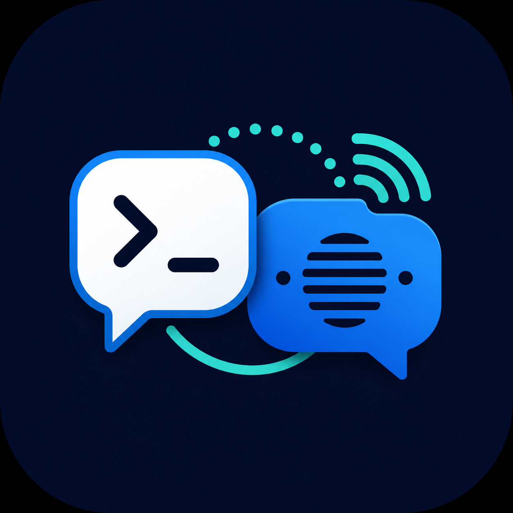

# Codex Intercom

<p>
  
  
</p>

Codex MCP plugin for direct local messaging with Pi and Codex coding-agent
sessions on the same machine.

Codex Intercom speaks the same local broker protocol as `pi-intercom`, so Codex
sessions can list Pi sessions, send direct messages, ask blocking questions,
check pending inbound messages, and reply to pending asks.

## Status

Preview. This is the Codex-side adapter split out of `pi-intercom`.

Codex MCP does not currently provide Pi-style unsolicited turn wake-up. Incoming
messages are queued while this MCP server is running; call `intercom_pending`
to read unread messages and unresolved asks.

For wake-on-message workflows, run the app-server bridge daemon. It publishes
configured virtual Codex workers as intercom sessions. Messages sent to those
workers create or resume Codex app-server threads and start a turn; blocking
asks are answered with the worker's final assistant message.

## Tools

- `intercom_whoami`
- `intercom_status`
- `intercom_list`
- `intercom_set_summary`
- `intercom_send`
- `intercom_ask`
- `intercom_pending`
- `intercom_reply`

## Local Setup

Use the built MCP server for a stable local install:

```bash
git clone https://github.com/dataforxyz/codex-intercom.git
cd codex-intercom
npm install
npm run build
codex mcp add codex-intercom -- node ./dist/codex-server.mjs
```

For development, you can keep running the TypeScript source directly:

```bash
codex mcp add codex-intercom-dev -- npx --no-install tsx ./codex/server.ts
```

Use either the built install or the dev install in a given Codex profile. Running
both at the same time can register duplicate intercom MCP tools.

Optional identity variables:

```bash
CODEX_INTERCOM_NAME=planner
CODEX_INTERCOM_SESSION_ID=codex-planner
CODEX_INTERCOM_MODEL=codex
```

When Codex launches the MCP server, those variables must be configured on the
MCP server itself. Per-command variables passed to `codex exec` are not
forwarded into the MCP server process.

```bash
codex mcp add codex-planner \
  --env CODEX_INTERCOM_NAME=planner \
  --env CODEX_INTERCOM_SESSION_ID=codex-planner \
  -- node /absolute/path/to/codex-intercom/dist/codex-server.mjs
```

For ad hoc multi-Codex runs, the easiest discovery flow is to have the receiver
call `intercom_set_summary` with a unique role or token, then have the sender
call `intercom_list` and target the matching session ID.

## Codex Plugin

This repo includes Codex plugin metadata:

- `.codex-plugin/plugin.json`
- `.mcp.json`
- `skills/codex-intercom/SKILL.md`

The plugin runs the MCP server with:

```bash
node ./dist/codex-server.mjs
```

That means a local checkout needs `npm install` and `npm run build` before
Codex starts the MCP server. The installed plugin does not need `tsx` at
runtime; the built server starts the bundled broker with `node`.

The plugin install path is separate from the dev MCP path above. Installing and
enabling the plugin makes its bundled MCP server and skill available in new
Codex threads; leaving it uninstalled or disabled does not affect a direct MCP
setup.

## App-Server Bridge

Use the bridge when the receiver should not have to keep an interactive Codex
turn open just to notice messages.

Create a bridge config:

```json
{
  "statePath": "/home/you/.pi/agent/intercom/codex-bridge-state.json",
  "agents": [
    {
      "id": "codex-worker",
      "name": "codex-worker",
      "cwd": "/home/you/src/project",
      "model": "gpt-5.5",
      "instructions": "Reply concisely. Ask before making destructive changes."
    }
  ]
}
```

Start it:

```bash
npm run codex:bridge -- --config /home/you/.pi/agent/intercom/codex-bridge.json
```

Then other local sessions can target `codex-worker` with `intercom_send` or
`intercom_ask`. The bridge stores each worker's app-server `threadId` in
`statePath`, so later messages continue the same Codex thread.

By default, bridge turns run with `approvalPolicy: "never"` and read-only,
network-disabled sandboxing. Override `approvalPolicy` or `sandboxPolicy` in
the agent config only when you explicitly want a background worker to have more
authority.

The bridge defaults to spawning `codex app-server` directly over JSONL stdio.
For a separately managed app-server socket, use Unix WebSocket transport:

```json
{
  "appServer": {
    "transport": "unix-websocket",
    "socketPath": "/home/you/.pi/agent/intercom/codex.sock"
  },
  "agents": [
    { "id": "codex-worker", "cwd": "/home/you/src/project" }
  ]
}
```

Start that socket separately with:

```bash
codex app-server --listen unix:///home/you/.pi/agent/intercom/codex.sock
```

## Examples

List sessions:

```typescript
intercom_list({ scope: "machine" })
```

Send a non-blocking update:

```typescript
intercom_send({
  to: "worker",
  message: "I found the failing test. Check src/api/client.test.ts."
})
```

Ask and wait:

```typescript
intercom_ask({
  to: "planner",
  message: "Should retry apply only to idempotent endpoints?",
  timeout_ms: 45000
})
```

Blocking asks default to 45 seconds and reject waits over 120 seconds. For
longer-running work, use `intercom_send` and check later with
`intercom_pending` instead of blocking the agent turn. If Codex cancels the
tool call, the pending ask is cancelled immediately.

Check and reply:

```typescript
intercom_pending({ mark_read: false })
intercom_reply({ message: "Use GET/PUT/DELETE only, max 3 retries." })
```

Two-Codex handoff pattern:

```typescript
// Receiver
intercom_set_summary({ summary: "worker: retry tests" })
intercom_pending({ mark_read: true })

// Sender
intercom_list({ scope: "machine", include_self: true })
intercom_send({
  to: "codex-session-id-from-list",
  message: "Retry tests are ready; please check the pending failure."
})
```

Wake an app-server-backed virtual worker:

```typescript
intercom_ask({
  to: "codex-worker",
  message: "Please inspect the latest failing test and reply with the likely cause.",
  timeout_ms: 45000
})
```

## `coi` Sidecar Launcher

`coi` starts a per-agent Codex app-server socket, registers an intercom sidecar
for that socket, creates or resumes the sidecar's app-server thread, then
launches an interactive Codex UI attached to that same socket and thread.

```bash
npm run coi -- --profile cliproxy
```

Build or link the installable command:

```bash
npm run build
npm link
codex mcp add codex-intercom -- codex-intercom-mcp
codex-intercom-bridge --config /home/you/.pi/agent/intercom/codex-bridge.json
coi --profile cliproxy
```

Useful sidecar flags:

```bash
npm run coi -- --name api-worker --id api-worker --profile cliproxy
npm run coi -- --cwd /home/you/src/project --instructions "Reply tersely."
npm run coi -- --no-tui --name smoke-worker
```

Everything not recognized as a sidecar flag is passed through to `codex
resume --remote`, so existing profile/model/sandbox flags still work. Prompt
arguments are placed after the resumed sidecar thread id. The sidecar inherits
`CODEX_HOME`, which means it can be used from either a normal Codex environment
or an alternate one such as `CODEX_HOME=~/.codex-alt`.

Current limitation: the sidecar can be messaged while the `coi` process is
running and will wake an app-server-backed Codex turn. It does not make every
ordinary `codex` process wakeable; launch the agent through `coi` when you want
this behavior. Blocking asks can set `timeout_ms`; sidecar asks default to 45
seconds and reject waits over 120 seconds. Sidecar-originated intercom sends are
capped per turn and per minute to prevent unattended ping-pong loops.

## Minimal Wakeable Codex Profile

Use a separate `CODEX_HOME` when you want a small Codex environment dedicated to
intercom work. This avoids your normal Codex config, memories, plugins, and
installed skills while still keeping `coi` wake-on-message behavior.

Create the home and config:

```bash
export CODEX_MIN_HOME="$HOME/.codex-min-intercom"
export CODEX_INTERCOM_REPO="/absolute/path/to/codex-intercom"
mkdir -p "$CODEX_MIN_HOME"
```

`$CODEX_MIN_HOME/config.toml`:

```toml
model = "gpt-5.5"
web_search = "disabled"

[features]
apps = false
memories = false
web_search = false
web_search_cached = false
web_search_request = false

# Keep the core coding-agent surface.
goals = true
multi_agent = true
shell_tool = true
unified_exec = true
auto_compaction = true
tool_call_mcp_elicitation = true

# Disable optional/distraction-heavy surfaces.
browser_use = false
browser_use_external = false
browser_use_full_cdp_access = false
in_app_browser = false
computer_use = false
image_generation = false
plugins = false
plugin_sharing = false
tool_suggest = false
skill_mcp_dependency_install = false
hooks = false
workspace_dependencies = false

[mcp_servers.codex-intercom]
command = "node"
args = ["/absolute/path/to/codex-intercom/dist/codex-server.mjs"]
```

After the first launch, Codex may populate system skills under the alternate
home. To keep the profile minimal without deleting anything, list the skill
paths and add per-skill disables:

```bash
find "$CODEX_MIN_HOME/skills" -name SKILL.md -print
```

For each path you want disabled, add:

```toml
[[skills.config]]
path = "/absolute/path/from/find/SKILL.md"
enabled = false
```

There is no required alias name, but a short one such as `cim` keeps the command
easy to launch:

```bash
cim() {
  local home="${CODEX_MIN_HOME:-$HOME/.codex-min-intercom}"
  local repo="${CODEX_INTERCOM_REPO:-$HOME/src/codex-intercom}"
  CODEX_HOME="$home" node "$repo/dist/coi.mjs" --name codex-min "$@"
}
```

Use it like:

```bash
cim
cim --id worker-a --instructions "Reply tersely."
cim --no-tui --id background-worker
```

This is intentionally not the same as launching plain `codex` with an MCP
server. Plain MCP sessions can receive queued messages, but they do not wake
automatically. `coi` is the part that registers an app-server sidecar and starts
a Codex turn when another session sends `intercom_send` or `intercom_ask`.

## Relationship To Pi Intercom

`pi-intercom` remains the Pi-native extension with overlays, inline rendering,
and Pi `triggerTurn` delivery. `codex-intercom` is the Codex MCP/plugin
adapter plus an optional Codex app-server bridge for wake-on-message virtual
workers.

For now this repository vendors the minimal local broker/client protocol for
compatibility. If the protocol stabilizes across multiple adapters, the shared
parts should move into a small core package.

## Test

```bash
npm test
```
